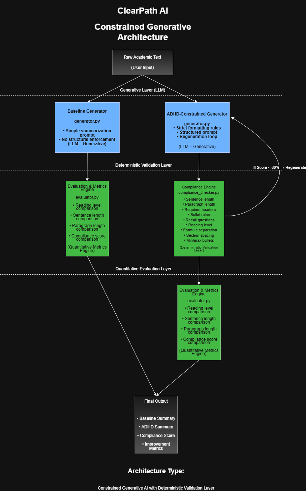

# ClearPath AI  
### ADHD-Constrained Study Summary Generator

---
## Table of Contents
Overview
Problem
Solution
System Architecture
ADHD Compliance Rules
Compliance Scoring
Evaluation Metrics
Project Structure
How to Run
Example Output Metrics
Research Foundation
Project Classification
Future Work
Demo Video
---

## Overview

ClearPath AI is a structured AI summarization system designed to generate cognitively optimized study summaries for learners with ADHD.

Unlike traditional AI summaries, this system enforces **research-backed, measurable formatting constraints** using a deterministic compliance engine.

The project combines:

- Generative AI (LLM-based summarization)
- Deterministic structural validation
- Quantitative compliance scoring
- Research-grounded cognitive design

---

## Problem

Students with ADHD often struggle with:

- Long, dense paragraphs
- Complex sentence structures
- Poor visual segmentation
- Lack of retrieval-based review questions
- High reading complexity

Standard AI summaries do not optimize for cognitive accessibility.

ClearPath AI introduces a validation layer that ensures summaries follow measurable ADHD-friendly constraints.

---

## Solution

The system generates two summaries:

1. **Baseline Summary** (standard AI output)
2. **ADHD-Constrained Summary** (validated against 10 rules)

The ADHD version is regenerated automatically if it fails compliance thresholds.

---

## System Architecture

---
---

## ADHD Compliance Rules (10 Total)

The Compliance Engine validates:

1. Maximum 20 words per sentence  
2. Maximum 80 words per paragraph  
3. Required section headers:
   - `## Learning Objectives`
   - `## Key Concepts`
   - `## Recall Questions`
4. Bullet formatting in Key Concepts  
5. Minimum 2 recall questions  
6. Reading level ≤ Grade 8 (Flesch–Kincaid)  
7. Formulas must appear on their own line  
8. Blank line between sections  
9. Minimum 3 Key Concept bullets  
10. Maximum 6 Key Concept bullets  

---

## Compliance Scoring

Each rule contributes equally.

Compliance Score = (Passed Rules ÷ 10) × 100

A summary is considered **ADHD-Compliant** if:

Score ≥ 80%

---

## Evaluation Metrics

The system automatically computes:

- Flesch–Kincaid Reading Level
- Average Sentence Length
- Average Paragraph Length
- Compliance Score

It compares baseline vs ADHD-constrained outputs quantitatively.

---

## Project Structure

ClearpathAI/
│
│
├── demo/
│   └── ClearPath AI Demo.mp4
│
├── docs/
│   ├── ADHD_compliance_spec.md
│   ├── architecture.PNG
│   ├── evaluation_test_cases.md
│   ├── PRD.md
│   ├── research_justification.md
│   └── spike_results.md
│
├── src/
│   ├── generator.py
│   ├── compliance_checker.py
│   ├── evaluator.py
│   └── llm_integration.py
│
├── tests/
│   └── test_compliance.py
│ 
├── README.md
├── .env.example
├── test_api.py
├── references.md
├── requirements.txt
└── .gitignore

---

## How to Run

### 1. Activate Virtual Environment

Windows:

.venv\Scripts\activate

Mac/Linux:

source .venv/bin/activate

### 2. Install Dependencies

pip install -r requirements.txt

### 3. Run Evaluation Script/ ClearpathAI App

streamlit run app.py

The script will:

- Generate both summaries
- Evaluate compliance
- Print quantitative comparison results

---

## Example Output Metrics

Baseline:
reading_level: 12.4
avg_sentence_length: 24.8
avg_paragraph_length: 132.5
compliance_score: 30

ADHD Version:
reading_level: 6.9
avg_sentence_length: 14.2
avg_paragraph_length: 54.1
compliance_score: 90

---

## Research Foundation

All structural rules are derived from peer-reviewed research in:

- Cognitive Load Theory
- Working Memory Limitations
- Readability Science
- Retrieval Practice

See `References.md` for full citations.

---

## Project Classification

This project demonstrates:

- Constrained Generative AI
- Deterministic Validation Architecture
- Human-Centered NLP Design
- Quantitative Evaluation Framework

This is not prompt engineering alone.  
It is a structured generation + validation system.

---

## Future Work

- Adaptive personalization based on learner profile
- Real-time compliance feedback
- GUI interface
- Semantic simplification scoring
- Controlled user testing study

---

## Demo Video

Milestone 1 demonstration:

demo/ClearPath AI Demo.mp4

---